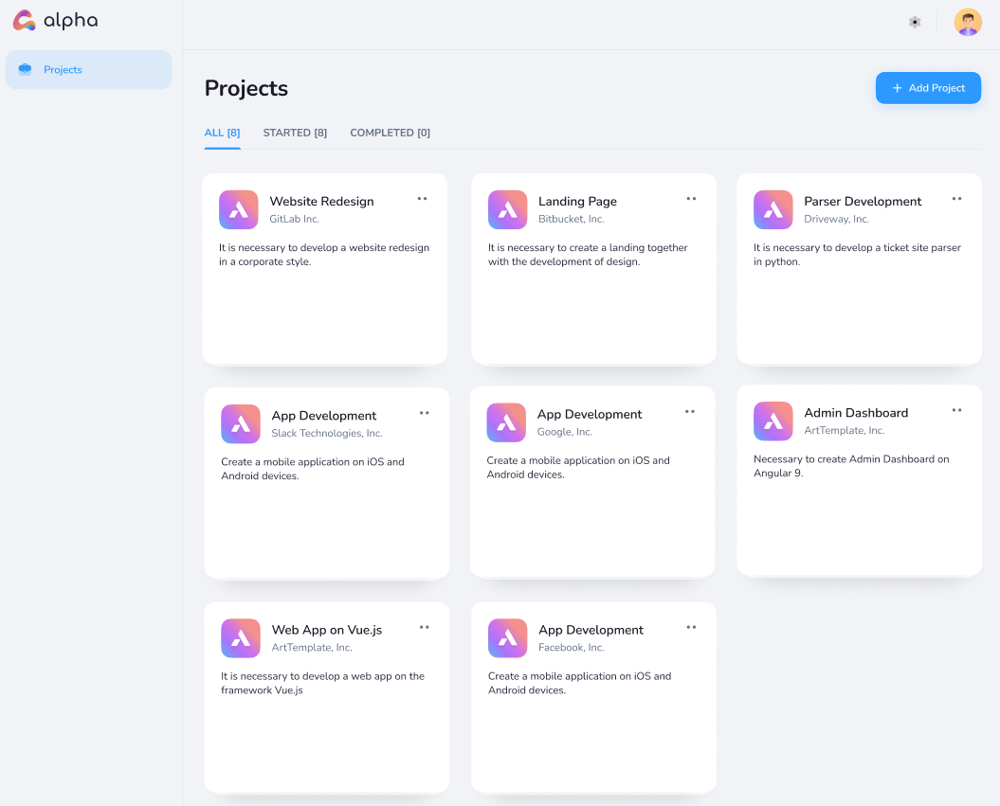
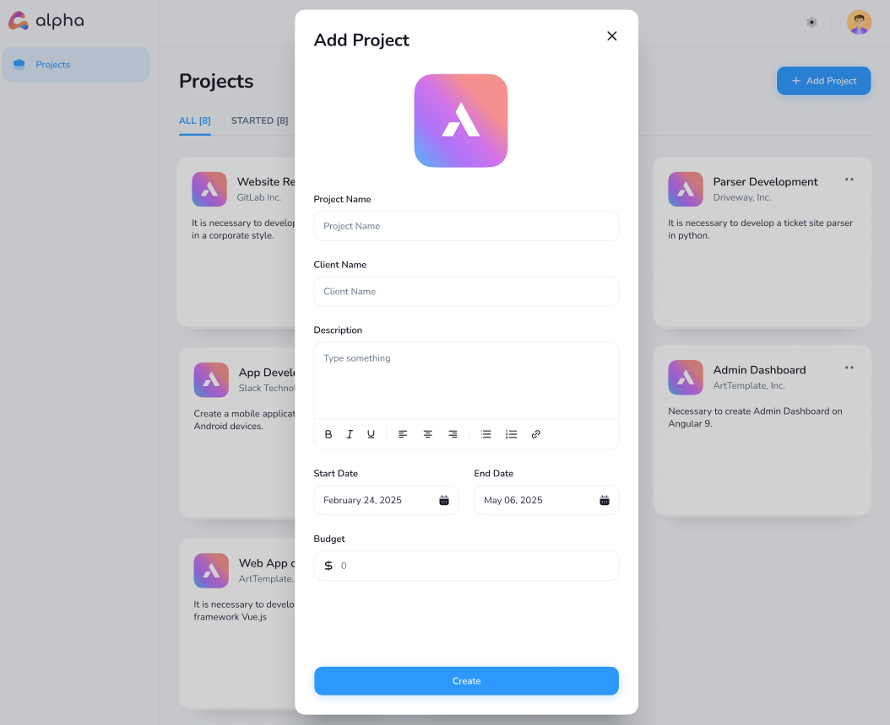

# 🅰️ Project Management System

  

A modern project management application built with ASP.NET Core MVC where users can create, manage, and track projects in a simple and efficient way.

## 📋 Features

- **User authentication and account management**
  - Register new user accounts
  - Secure login with password protection
  - User profile with associated projects

- **Complete project management**
  - Create new projects with detailed information
  - Edit and update existing projects
  - Sort projects by status (Started/Completed)
  - View all projects in an organized dashboard

- **Project information management**
  - Store client details for each project
  - Track project budget information
  - Manage project timelines with start and end dates
  - Add detailed project descriptions

- **User-friendly interface**
  - Clean, modern UI based on Figma designs
  - Responsive design for various screen sizes
  - Intuitive project cards with status indicators

## 🧰 Technologies

- **Backend**
  - ASP.NET Core 8.0 MVC
  - Entity Framework Core 8.0
  - Identity for authentication and authorization
  - SQL Server database
  - Service Pattern implementation

- **Frontend**
  - Bootstrap 5
  - jQuery
  - JavaScript for client-side validation
  - CSS3 for custom styling
  - Responsive design

 ## 📷 Screenshots

### Project Dashboard


### Add Projects


## 🚀 Getting Started

1. Clone the repository
2. Open the solution in Visual Studio 2022
3. Restore NuGet packages
4. Update the database connection string in `appsettings.json` if needed
5. Run the following commands in Package Manager Console:
   ```
   Add-Migration InitialCreate
   Update-Database
   ```
6. Build and run the application
7. Register a new account or use the default test account:
   - Email: test@example.com
   - Password: Test123!

## 📷 Screenshots

- Login screen
- Project dashboard
- Add/Edit project modal
- Project listing with filter tabs


## 🧑‍💻 Author

Created as part of a course project for ASP.NET MVC development.